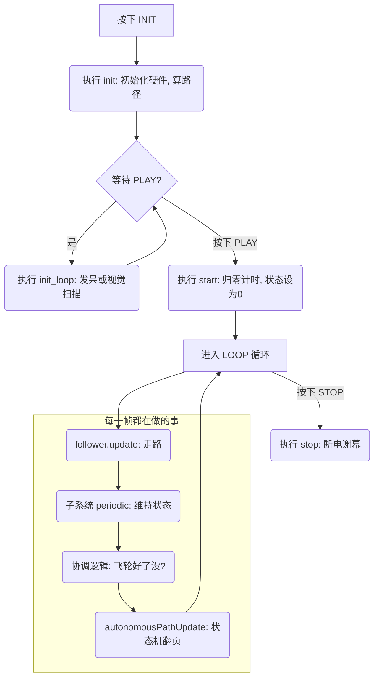

```mermaid
graph TD
    A[按下 INIT] --> B(执行 init: 初始化硬件, 算路径)
    B --> C{等待 PLAY?}
    C -- 是 --> D(执行 init_loop: 发呆或视觉扫描)
    D --> C
    C -- 按下 PLAY --> E(执行 start: 归零计时, 状态设为0)
    E --> F[进入 LOOP 循环]
    
    subgraph LOOP [每一帧都在做的事]
    G(follower.update: 走路)
    H(子系统 periodic: 维持状态)
    I(协调逻辑: 飞轮好了没?)
    J(autonomousPathUpdate: 状态机翻页)
    end
    
    F --> G --> H --> I --> J --> F
    
    F -- 按下 STOP --> K(执行 stop: 断电谢幕)
```