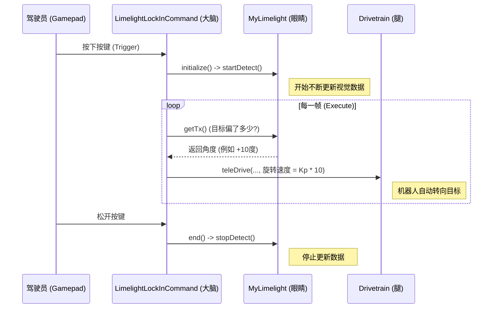

limelightLockInCommand 工作流程图

```mermaid
sequenceDiagram
    participant User as 驾驶员 (Gamepad)
    participant Cmd as LimelightLockInCommand (大脑)
    participant Sub as MyLimelight (眼睛)
    participant Drive as Drivetrain (腿)

    User->>Cmd: 按下按键 (Trigger)
    Cmd->>Sub: initialize() -> startDetect()
    Note right of Sub: 开始不断更新视觉数据

    loop 每一帧 (Execute)
        Cmd->>Sub: getTx() (目标偏了多少?)
        Sub-->>Cmd: 返回角度 (例如 +10度)
        Cmd->>Drive: teleDrive(..., 旋转速度 = Kp * 10)
        Note right of Drive: 机器人自动转向目标
    end

    User->>Cmd: 松开按键
    Cmd->>Sub: end() -> stopDetect()
    Note right of Sub: 停止更新数据
```